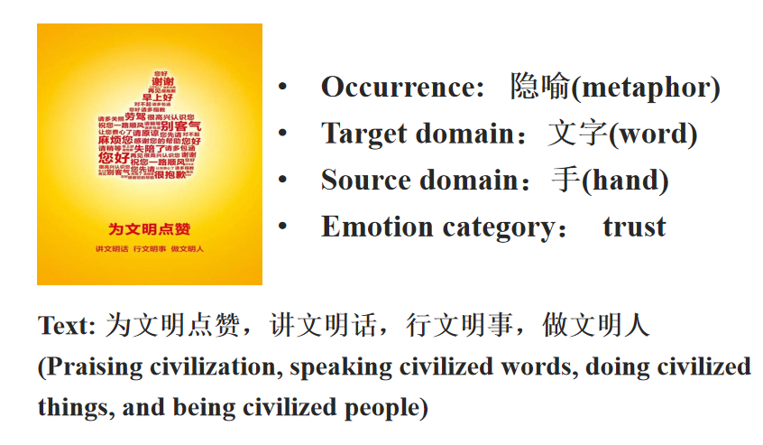

# EmoMeta: A Chinese Multimodal Metaphor Dataset and Novel Method for Emotion Classification

We release our Dataset, a multimodal metaphorical emotion dataset in chinese consisting of 5000 pairs of text and images, with annotations indicating the presence of metaphors, target domain, source domain and emotion categories.
Our dataset is presented in the DataALL.xlsx file.

## Cite
** Lu, X., Liu, Y., Zhang, D., Wu, Z., Ren, J., & Xia, F. (2025, May). EmoMeta: A Multimodal Dataset for Fine-grained Emotion Classification in Chinese Metaphors. In Companion Proceedings of the ACM on Web Conference 2025 (pp. 3080-3083).**

## Example Instance

.

In this example, words are arranged to form a hand giving a thumbs-up, expressing appreciation for civilized behavior. Therefore, the target domain is words, the source domain is the hand, and the sentiment is trust.

## Annotation Guideline
**We provide annotators with annotation guidelines.The specific labeling steps are as follows:**

* Our annotators identify incongruent units by examining the text and visual elements, often indicating the presence of metaphors. 
* They identify these incongruent units and interpret the irreversible "A is B" identity relationship to recognize metaphorical text-image pairs.
* By determining the primary theme that a sample intends to convey, one selects one of the two entities as the target domain, with the other entity describing the target domain referred to as the source domain.
* They identify the most appropriate emotion.
  
**The classification and explanation of sentiments are as follows:**

  
* **Joy**: Joy encompasses a sense of happiness, optimism, and relaxation, embracing feelings of tranquility and ecstasy.
* **Love**: Love is a profound and positive emotional and psychological state, signifying deep and sincere affection towards individuals or entities. This sentiment has the power to evoke warm attraction, intense passion, and selfless dedication. Typically, love manifests in interpersonal relationships, such as those between family members, friends, or romantic partners.
* **Trust**: Trust involves the belief that someone or something is good, sincere, and honest. It encompasses emotions associated with acceptance, liking, and appreciation.
* **Fea**r: Fear conveys a negative sensation that arises in the face of danger or when confronted with something frightening. It encompasses emotions such as worry, anxiety, and panic, encapsulating a range of feelings including apprehension, anxiety, and terror.
* **Sadness**: Sadness is commonly employed to characterize the psychological state experienced when confronting negative emotions like loss and pain. This emotional state typically manifests as a psychological condition marked by feelings of frustration, pensiveness, or grief.
* **Disgust**: Disgust denotes a profound aversion towards someone or something deemed unacceptable, distasteful, or possessing unpleasant visual or olfactory qualities. This emotional response can encompass disinterest, dislike, or even a sense of loathing.
* **Anger**: Anger is a potent emotion that surfaces when confronted with something bad or unjust. It encompasses feelings of trouble and rage, including annoyance and intense displeasure.
* **Surprise**: Surprise is the emotion elicited by unforeseen or sudden events, manifesting in a state of distraction and amazement. 
* **Anticipation**: Anticipation conveys a sense of excitement about an impending event, typically perceived as favorable. Additionally, it can be interpreted as keen interest and heightened vigilance.
* **Neutral**: Neutral indicates that the advertisements evoke no specific emotional response.
## Data Format

| Key                     |                                    Value                                    |
|-------------------------|:---------------------------------------------------------------------------:|
| `Img_id`            |                The address of the image to be identified                  |
| `Img_url`            |                The URL for downloading the image                  |
| `Text`     |                                          The  text in the image                              |
| `Metaphor`|           Metaphorical judgment (0: Literal ; 1: Metaphor)          |
| `Target domain`|           Target domain in the metaphorical sample         |
| `Source domain`|           Source domain in the metaphorical sample          |
| `Emotion`            |                      The emotion of the metaphorical sample(1joy ; 2love ; 3trust ; 4fear ; 5sadness ; 6disgust ; 7anger ; 8surprise ; 9anticipation ; 10neutral)                 |

* The images with numbers from 9981.jpg to 11377.jpg are from the IFlytek Advertising Image Classification Competition, released in 2021, without corresponding URL are provided in file naming dataF.

## 🔬 Explore More Research from Our Lab

**Important❗**  If you use any of our lab's datasets, please make sure to cite them in the above format❗

1. **[MultiMET: A Multimodal Dataset for Metaphor Understanding (ACL 2021)](https://github.com/DUTIR-YSQ/MultiMET)**  
   A foundational multimodal dataset for metaphor understanding, combining text and visual modalities.  
   **Citation Format**:  
   Dongyu Zhang, Minghao Zhang, Heting Zhang, Liang Yang, and Hongfei Lin. 2021. MultiMET: A Multimodal Dataset for Metaphor Understanding. In Proceedings of the 59th Annual Meeting of the Association for Computational Linguistics and the 11th International Joint Conference on Natural Language Processing (Volume 1: Long Papers), pages 3214–3225, Online. Association for Computational Linguistics.

2. **[Cultural Bias Matters: A Cross-Cultural Benchmark Dataset and Sentiment-Enriched Model for Understanding Multimodal Metaphors (ACL 2025)](https://github.com/DUTIR-YSQ/MultiMM)**  
   A cross-cultural benchmark dataset that incorporates sentiment signals to improve multimodal metaphor detection across languages.  
   **Citation Format**:  
   Senqi Yang, Dongyu Zhang, Jing Ren, Ziqi Xu, Xiuzhen Zhang, Yiliao Song, Hongfei Lin, and Feng Xia. 2025. *Cultural Bias Matters: A Cross-Cultural Benchmark Dataset and Sentiment-Enriched Model for Understanding Multimodal Metaphors*. In *Proceedings of the 63rd Annual Meeting of the Association for Computational Linguistics (Volume 1: Long Papers)*, pages XX–XX, **Vienna, Austria**. Association for Computational Linguistics.

3. **[EmoMeta: A Chinese Multimodal Metaphor Dataset and Novel Method for Emotion Classification (WWW 2025)](https://github.com/DUTIR-YSQ/EmoMeta)**  
   A new Chinese dataset and method for emotion classification based on multimodal metaphors.  
   **Citation Format**:  
   Lu, X., Liu, Y., Zhang, D., Wu, Z., Ren, J., & Xia, F. (2025, May). EmoMeta: A Multimodal Dataset for Fine-grained Emotion Classification in Chinese Metaphors. In Companion Proceedings of the ACM on Web Conference 2025 (pp. 3080-3083).

4. **[MultiCMET: A Novel Chinese Benchmark for Understanding Multimodal Metaphor (EMNLP 2023)](https://github.com/DUTIR-YSQ/MultiCMET)**  
   A high-quality Chinese benchmark designed to support multimodal metaphor understanding in NLP and vision-language tasks.  
   **Citation Format**:  
   Zhang, D., Yu, J., Jin, S., Yang, L., & Lin, H. (2023, December). Multicmet: A novel Chinese benchmark for understanding multimodal metaphor. In Findings of the Association for Computational Linguistics: EMNLP 2023 (pp. 6141-6154).

---

